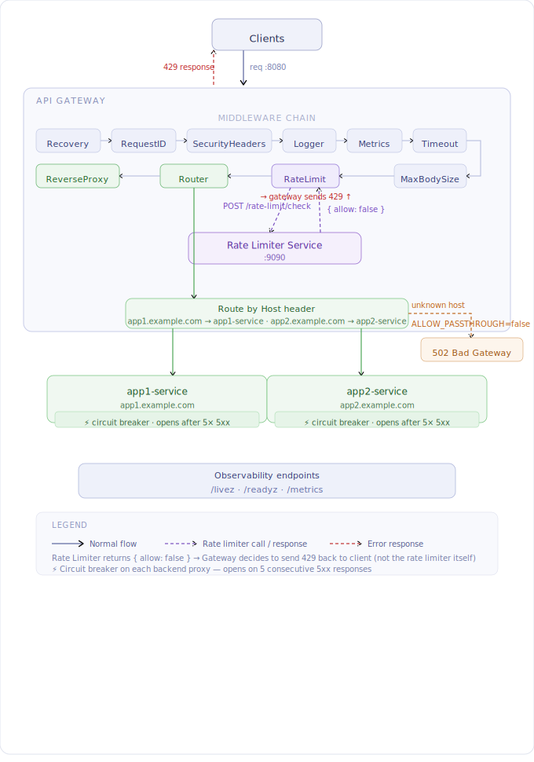

# API Gateway

A lightweight, production-grade API Gateway written in Go. Acts as a single entry point for multiple backend services, enforcing rate limiting before forwarding requests.

## Table of Contents

- [Overview](#overview)
- [Architecture](#architecture)
- [Project Structure](#project-structure)
- [Middleware Chain](#middleware-chain)
- [How It Works](#how-it-works)
- [Configuration](#configuration)
- [API Reference](#api-reference)
- [Getting Started](#getting-started)
- [Docker](#docker)
- [Development](#development)
- [Error Handling](#error-handling)

---

## Overview

The API Gateway sits in front of multiple backend services (`app1.test.com`, `app2.test.com`, etc.) and:

1. Receives all incoming client requests
2. Consults the **Rate Limiter Service** to validate the client's token/credit budget
3. Forwards allowed requests to the correct backend via a reverse proxy
4. Rejects rate-limited requests with `HTTP 429 Too Many Requests`

---

## Architecture



```
                          ┌─────────────────────┐
                          │   Rate Limiter Svc  │
                          │  :9090              │
                          └──────────┬──────────┘
                                     │ POST /rate-limit/check
                                     │
Client ──► app1.test.com ──► ┌───────┴────────┐ ──► http://app1-service
Client ──► app2.test.com ──► │  API Gateway   │ ──► http://app2-service
                             │  :8080         │
                             └────────────────┘
                                     │
                              HTTP 429 if denied
```

**Request flow:**

```
Incoming Request
      │
      ▼
Rate Limit Middleware
      │
      ├── allowed = false ──► 429 Too Many Requests
      │
      └── allowed = true
            │
            ▼
      Host-based Router
            │
            ├── app1.test.com ──► Reverse Proxy ──► http://app1-service
            └── app2.test.com ──► Reverse Proxy ──► http://app2-service
```

---

## Project Structure

```
api-gateway/
├── cmd/
│   └── main.go                  # Entry point: server setup, middleware chain, graceful shutdown
├── config/
│   └── config.go                # Env var config with validation
├── client/
│   └── rate_limiter_client.go   # HTTP client for the Rate Limiter Service
├── middleware/
│   ├── recovery.go              # Panic recovery → 500
│   ├── request_id.go            # Request ID injection (X-Request-ID)
│   ├── logger.go                # Structured access logging
│   ├── metrics.go               # Prometheus metrics
│   ├── rate_limit.go            # Rate limit check before routing
│   ├── security_headers.go      # X-Frame-Options, X-XSS-Protection, CSP, etc.
│   ├── body_limit.go            # Request body size cap (prevents memory exhaustion)
│   └── timeout.go               # Per-request context timeout (cancels slow backends)
├── proxy/
│   └── reverse_proxy.go         # Reverse proxy with circuit breaker + tuned transport
├── router/
│   └── router.go                # Host-based routing with passthrough support
├── Dockerfile                   # Multi-stage build (non-root user, wget for probes)
├── .dockerignore                # Files excluded from Docker image
├── docker-compose.yml           # Local development setup
├── routes.yaml                  # Host → backend route definitions (used when ROUTES_FILE is set)
├── .env.example                 # All supported environment variables with descriptions
└── go.mod
```

---

## Middleware Chain

Every request passes through this chain in order:

```
Incoming Request
      │
      ▼
1. Recovery          → catches panics → 500 (server never crashes)
      │
      ▼
2. RequestID         → injects X-Request-ID for log correlation
      │
      ▼
3. SecurityHeaders   → sets X-Frame-Options, X-XSS-Protection, CSP, etc.
      │
      ▼
4. Logger            → structured access log (method, host, path, status, duration)
      │
      ▼
5. Metrics           → Prometheus counters and histograms
      │
      ▼
6. Timeout           → cancels request context after REQUEST_TIMEOUT_SECONDS
      │
      ▼
7. MaxBodySize       → rejects bodies over MAX_BODY_MB → 413
      │
      ▼
8. RateLimit         → calls Rate Limiter Service (skipped for unknown hosts)
      │
      ├── denied → 429 Too Many Requests
      │
      └── allowed
            │
            ▼
9. Router            → matches Host header → backend proxy
            │
            ▼
10. ReverseProxy     → forwards to backend (circuit breaker + tuned transport)
```

---

## How It Works

### Rate Limiting

Before forwarding any request, the gateway calls the Rate Limiter Service:

```
POST http://rate-limiter-service/rate-limit/check
Content-Type: application/json

{
  "clientId": "user123",
  "appId":    "app1",
  "endpoint": "/api/orders"
}
```

Response:

```json
{ "allowed": true }
```

- `clientId` — taken from the `X-Client-ID` request header; falls back to client IP
- `appId` — derived from the subdomain (e.g., `app1.test.com` → `app1`)
- `endpoint` — the request path

**Fail-open policy:** if the Rate Limiter Service is unreachable, requests are allowed through and the error is logged.

### Host-based Routing

Requests are routed to backends based on the `Host` header:

| Host | Backend |
|---|---|
| `app1.test.com` | `http://app1-service` |
| `app2.test.com` | `http://app2-service` |

### Pass-through for Unconfigured Hosts

This behavior is **only active when `ALLOW_PASSTHROUGH=true`**. When false (default), unknown hosts receive `502 Bad Gateway`.

If a host is **not defined** in the config (e.g. `app3.test.com`) and pass-through is enabled, the gateway:

1. **Skips rate limiting** — no check is made to the Rate Limiter Service
2. **Proxies the request directly** to `http://app3.test.com` as-is

```
Request: app3.test.com  (not in config, ALLOW_PASSTHROUGH=true)
        │
        ▼
Rate Limit Middleware → skipped (host not in routes)
        │
        ▼
Router → no match found → proxy directly to http://app3.test.com
```

This allows the gateway to act as a transparent proxy for any host not explicitly configured, without blocking or rate limiting it.

---

## Configuration

All configuration is provided via environment variables.

| Variable | Default | Description |
|---|---|---|
| `PORT` | `8080` | Port the gateway listens on |
| `LOG_LEVEL` | `info` | Log verbosity: `debug`, `info`, `warn`, `error` |
| `RATE_LIMITER_URL` | `http://localhost:9090` | Base URL of the Rate Limiter Service |
| `ROUTES_FILE` | _(empty)_ | Path to a YAML routes file (preferred); when set, `APP*` vars are ignored |
| `APP1_HOST` | `app1.test.com` | Hostname for app1 (used only when `ROUTES_FILE` is not set) |
| `APP1_BACKEND` | `http://app1-service` | Backend URL for app1 (used only when `ROUTES_FILE` is not set) |
| `APP2_HOST` | `app2.test.com` | Hostname for app2 (used only when `ROUTES_FILE` is not set) |
| `APP2_BACKEND` | `http://app2-service` | Backend URL for app2 (used only when `ROUTES_FILE` is not set) |
| `ALLOW_PASSTHROUGH` | `false` | If `true`, unknown hosts are proxied directly; if `false`, they get 502 |
| `TLS_CERT_FILE` | _(empty)_ | Path to TLS certificate (enables HTTPS when set with key) |
| `TLS_KEY_FILE` | _(empty)_ | Path to TLS private key (enables HTTPS when set with cert) |
| `METRICS_TOKEN` | _(empty)_ | Bearer token to protect `/metrics`; leave empty to allow open access |
| `MAX_BODY_MB` | `10` | Maximum request body size in megabytes |
| `REQUEST_TIMEOUT_SECONDS` | `30` | Per-request timeout; cancels slow backend connections |

---

## API Reference

### `GET /livez`

Liveness probe — confirms the process is alive. Used by Docker and Kubernetes.

```
GET /livez  →  200 OK  →  ok
```

### `GET /readyz`

Readiness probe — confirms the gateway and its dependencies (Rate Limiter Service) are ready to serve traffic. Kubernetes stops routing traffic to the pod when this returns non-200.

```
GET /readyz  →  200 OK            →  ready          (all dependencies reachable)
GET /readyz  →  503 Unavailable   →  rate limiter unreachable
```

### `GET /healthz`

Alias for `/livez` kept for backward compatibility.

### `GET /metrics`

Prometheus metrics endpoint. Exposes the following metrics:

| Metric | Type | Description |
|---|---|---|
| `gateway_requests_total` | Counter | Total requests by host, method, status |
| `gateway_request_duration_seconds` | Histogram | Request latency by host and method |
| `gateway_rate_limited_total` | Counter | Total rate-limited requests by host |

If `METRICS_TOKEN` is set, requests must include:
```
Authorization: Bearer <token>
```

### `* /*`

All other requests are rate-checked and proxied to the appropriate backend.

**Request headers:**

| Header | Required | Description |
|---|---|---|
| `Host` | Yes | Determines which backend to route to |
| `X-Client-ID` | No | Client identifier for rate limiting; falls back to IP |

**Error responses:**

| Status | Reason |
|---|---|
| `429 Too Many Requests` | Rate limit exceeded |
| `502 Bad Gateway` | Unknown host or backend unavailable |

---

## Getting Started

### Prerequisites

- [Go 1.22+](https://go.dev/dl/)
- Running Rate Limiter Service (or any HTTP server stubbing `POST /rate-limit/check`)

### Run locally

```bash
# Clone the repo
git clone <repo-url>
cd api-gateway

# Download dependencies and generate go.sum
go mod tidy

# Set environment variables
export RATE_LIMITER_URL=http://localhost:9090
export APP1_BACKEND=http://localhost:8081
export APP2_BACKEND=http://localhost:8082

# Run
go run ./cmd/main.go
```

### Run with TLS

```bash
export TLS_CERT_FILE=/path/to/cert.pem
export TLS_KEY_FILE=/path/to/key.pem
go run ./cmd/main.go
```

HTTP traffic on port 80 is automatically redirected to HTTPS.

### Build binary

```bash
go mod tidy
go build -o bin/api-gateway ./cmd/main.go
./bin/api-gateway
```

### Test the health check

```bash
curl http://localhost:8080/healthz
# ok
```

### Send a proxied request

```bash
curl -H "Host: app1.test.com" -H "X-Client-ID: user123" http://localhost:8080/api/orders
```

---

## Docker

### Why multi-stage build?

The Dockerfile uses a two-stage build:

| Stage | Base Image | Purpose |
|---|---|---|
| `builder` | `golang:1.26-alpine` | Compiles the Go binary |
| runtime | `alpine:3.21` | Runs only the binary (~10MB final image) |

Key build flags used:
- `CGO_ENABLED=0` — fully static binary, no C dependencies
- `GOOS=linux GOARCH=amd64` — explicit target platform
- Non-root user (`appuser`) — follows least-privilege principle

### Prerequisites

- [Docker](https://docs.docker.com/get-docker/) installed and running

### Build the image

```bash
docker build -t api-gateway .
```

### Run the container

```bash
docker run -p 8080:8080 \
  -e RATE_LIMITER_URL=http://rate-limiter:9090 \
  -e APP1_BACKEND=http://app1-service \
  -e APP2_BACKEND=http://app2-service \
  api-gateway
```

### Run with a custom port

```bash
docker run -p 9000:9000 \
  -e PORT=9000 \
  -e RATE_LIMITER_URL=http://rate-limiter:9090 \
  api-gateway
```

### Run in detached mode

```bash
docker run -d --name api-gateway \
  -p 8080:8080 \
  -e RATE_LIMITER_URL=http://rate-limiter:9090 \
  -e APP1_BACKEND=http://app1-service \
  -e APP2_BACKEND=http://app2-service \
  api-gateway
```

### Useful Docker commands

```bash
# View running containers
docker ps

# View logs
docker logs api-gateway

# Follow logs in real time
docker logs -f api-gateway

# Stop the container
docker stop api-gateway

# Remove the container
docker rm api-gateway

# Remove the image
docker rmi api-gateway
```

### Health check

```bash
curl http://localhost:8080/healthz
# ok
```

### What `.dockerignore` excludes

```
.git
.gitignore
Dockerfile
README.md
tmp
vendor
```

This keeps the build context small and prevents unnecessary files from being copied into the image.

---

## Development

### Run tests

```bash
go test ./...
```

### Lint

```bash
go vet ./...
```

### Adding a new backend

Edit `routes.yaml` and add an entry — no code change needed:

```yaml
routes:
  app1.example.com: http://app1-service
  app2.example.com: http://app2-service
  app3.example.com: http://app3-service   # new
```

Make sure `ROUTES_FILE` points to this file:

```bash
export ROUTES_FILE=./routes.yaml
```

---

## Error Handling

| Scenario | Behavior |
|---|---|
| Panic in any handler | Recovered — returns `500`, server keeps running |
| Request body exceeds `MAX_BODY_MB` | `413 Request Entity Too Large` |
| Request exceeds `REQUEST_TIMEOUT_SECONDS` | Context cancelled — backend receives cancellation signal |
| Rate limiter unreachable | Fail open — request is allowed, error is logged |
| Rate limit exceeded | `429 Too Many Requests` |
| Host not in config (`ALLOW_PASSTHROUGH=false`) | `502 Bad Gateway` |
| Host not in config (`ALLOW_PASSTHROUGH=true`) | Proxied directly to the host, no rate limit |
| Backend returns 5xx (5 consecutive) | Circuit breaker opens — `503 Service Unavailable` |
| Circuit breaker open | `503 Service Unavailable` until backend recovers (30s timeout) |
| Backend connection failure | `502 Bad Gateway` |
| `/metrics` without valid token | `401 Unauthorized` (only when `METRICS_TOKEN` is set) |
| Invalid config at startup | Server refuses to start, logs the error |
| Graceful shutdown | Drains in-flight requests with a 10s timeout |
